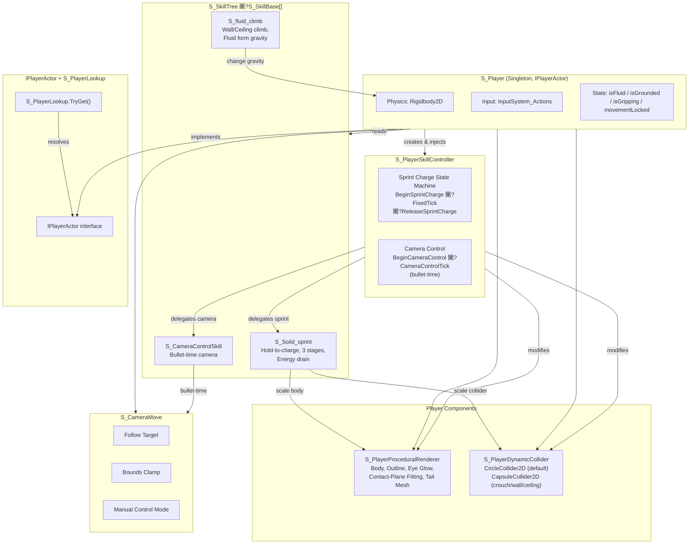
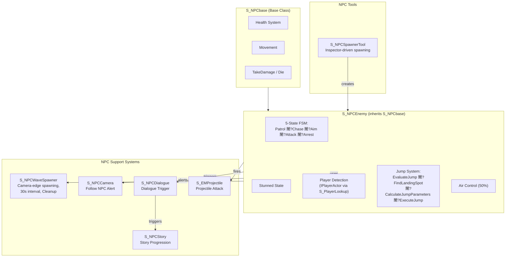
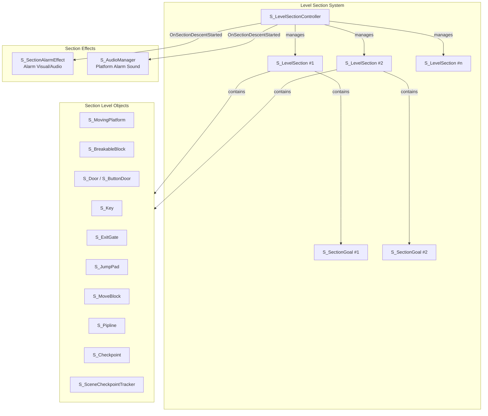
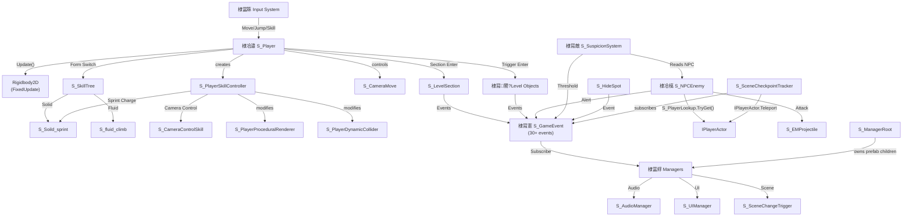
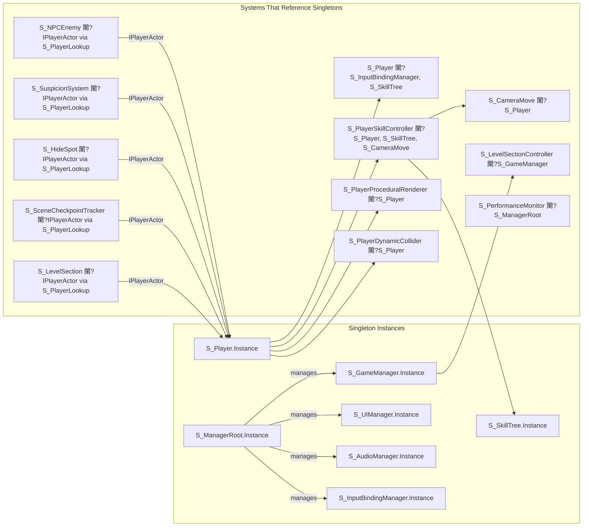

# InkForm Architecture

> Last updated: v0.8.1 (2026-05-25) - Gameplay UX, Energy, Scene Flow, ManagerRoot Hardening

## v0.8.1 Architecture Notes
- `ManagerRoot.prefab` is the only persistent root. Child managers live under it and do not self-create, self-reparent, or call `DontDestroyOnLoad`.
- Scene loading uses `S_SceneReference` drag references and runtime scene keys, with transition fade/SFX handled by `S_GameManager`.
- Player skills share one `S_PlayerEnergy` pool and broadcast `OnPlayerEnergyChanged(current, max)` for the UI.
- Death flow shows `S_UIManager`'s death panel first; checkpoint respawn happens only after `back to checkpoint` fires `GameReStart()`.

## 1. System Overview (C4-Style Context Diagram)

```mermaid
graph TB
    subgraph Input["棣冨箖 Input Layer"]
        IBM[S_InputBindingManager<br/>Singleton]
        IA[InputSystem_Actions]
    end

    subgraph Player["棣冾潚 Player System"]
        P[S_Player<br/>Singleton<br/>implements IPlayerActor]
        PContracts[IPlayerActor interface]
        PLookup[S_PlayerLookup<br/>static utility]
        PSC[S_PlayerSkillController]
        PE[S_PlayerEnergy<br/>shared skill energy]
    end

    subgraph PlayerBody["棣冪彿 Player Body"]
        PDR[S_PlayerDynamicCollider]
        SPPR[S_PlayerProceduralRenderer]
    end

    subgraph Skills["閳?Skill System"]
        ST[S_SkillTree<br/>Singleton]
        SB[S_SkillBase<br/>ScriptableObject]
        SSprint[S_Soild_sprint]
        SClimb[S_fluid_climb]
        SCCam[S_CameraControlSkill]
    end

    subgraph Camera["棣冩懖 Camera System"]
        CM[S_CameraMove]
        NPCCam[S_NPCCamera]
        PL[S_ParallaxLayer]
    end

    subgraph NPC["棣冾樆 NPC System"]
        NPCBase[S_NPCbase]
        NPCE[S_NPCEnemy]
        EMProj[S_EMProjectile]
        NPCWave[S_NPCWaveSpawner]
        NPCDial[S_NPCDialogue]
        NPCStory[S_NPCStory]
    end

    subgraph Suspicion["棣冩敵 Suspicion System"]
        SUS[S_SuspicionSystem]
        HS[S_HideSpot]
    end

    subgraph Level["棣冩閿?Level System"]
        subgraph Section["Section System"]
            LS[S_LevelSection]
            LSCtrl[S_LevelSectionController]
            SG[S_SectionGoal]
            SAE[S_SectionAlarmEffect]
        end
        subgraph LevelObj["Level Objects"]
            MP[S_MovingPlatform]
            BB[S_BreakableBlock]
            Door[S_Door]
            BDoor[S_ButtonDoor]
            Key[S_Key]
            EG[S_ExitGate]
            JP[S_JumpPad]
            MB[S_MoveBlock]
            Pipe[S_Pipline]
            CP[S_Checkpoint]
            SCT[S_SceneCheckpointTracker]
            DRI[S_DroppedResourceItem]
            DRC[S_DropResourceCounter]
            CC[S_CantClimb]
            PCV[S_PlatformCableVisual]
        end
    end

    subgraph Managers["棣冨綒 Manager Layer"]
        MR[S_ManagerRoot<br/>Singleton<br/>DontDestroyOnLoad]
        GM[S_GameManager<br/>Singleton]
        UI[S_UIManager<br/>Singleton]
        AM[S_AudioManager<br/>Singleton]
    end

    subgraph Events["棣冩憲 Event Bus"]
        GE[S_GameEvent<br/>Static<br/>30+ events]
    end

    subgraph Tools["棣冩暋 Tools"]
        NST[S_NPCSpawnerTool]
        PM[S_PerformanceMonitor]
        STR[S_setTrigger]
    end

    subgraph MCTS["棣冃?MCTS Testing"]
        MCTSBot[MCTSBotController]
        MCTSGS[MCTSGameState]
        MCTSN[MCTSNode]
        LTM[LevelTestMetrics]
    end

    subgraph SceneCtrl["棣冨箑 Scene Control"]
        SC[S_SceneChangeTrigger]
        SMC[S_StartMenuController]
    end

    %% Manager Root
    MR -->|"prefab child"| GM
    MR -->|"prefab child"| UI
    MR -->|"prefab child"| AM
    MR -->|"prefab child"| IBM

    %% Player architecture
    P -->|"implements"| PContracts
    P -->|"creates"| PSC
    P -->|"owns"| PE
    P -->|"manages"| SPPR
    P -->|"manages"| PDR
    P -->|"reads"| IBM
    P -->|"uses"| ST
    ST -->|"contains"| SB
    SB -->|"subclasses"| SSprint
    SB -->|"subclasses"| SClimb
    SB -->|"subclasses"| SCCam
    PSC -->|"delegates"| SSprint
    PSC -->|"delegates"| SCCam
    PSC -->|"drains"| PE
    PSC -->|"modifies"| SPPR
    PSC -->|"modifies"| PDR
    P -->|"controls"| CM

    %% IPlayerActor decoupling
    PLookup -->|"resolves"| PContracts
    NPCE -->|"uses"| PLookup
    HS -->|"uses"| PLookup
    SCT -->|"uses"| PLookup
    SUS -->|"uses"| PLookup

    %% Player 閳?Level
    P -->|"collides"| MP
    P -->|"triggers"| JP
    P -->|"uses"| Door
    P -->|"collects"| Key
    P -->|"enters"| HS
    P -->|"triggers"| CP
    P -->|"pushes"| MB

    %% NPC System
    NPCBase -->|"inherits"| NPCE
    NPCE -->|"spawns"| NPCWave
    NPCE -->|"fires"| EMProj
    NPCDial -->|"triggers"| NPCStory

    %% Events (all systems publish/subscribe through GE)
    P -.->|"publishes"| GE
    NPCE -.->|"publishes"| GE
    SUS -.->|"publishes"| GE
    LS -.->|"publishes"| GE
    Key -.->|"publishes"| GE
    SCT -.->|"subscribes"| GE
    GM -.->|"subscribes"| GE
    UI -.->|"subscribes"| GE
    AM -.->|"subscribes"| GE

    %% MCTS
    MCTSBot -->|"simulates"| P
    MCTSBot -->|"uses"| MCTSGS
    MCTSGS -->|"builds"| MCTSN
    MCTSBot -->|"measures"| LTM

    %% Tools
    NST -->|"spawns"| NPCE
```



## 2. Class Inheritance & Interface Diagram

```mermaid
classDiagram
    direction TB

    class MonoBehaviour {
        <<Unity>>
    }

    class ScriptableObject {
        <<Unity>>
    }

    %% === Interfaces ===
    class IPlayerActor {
        <<interface>>
        +Rigidbody2D Rigidbody
        +Collider2D Collider
        +Transform BodyTransform
        +bool IsFluidForm
        +bool IsParalyzed
        +bool IsSprintMomentumActive
        +bool FacingRight
        +Teleport(Vector2)
        +SetMovementLocked(bool)
        +ApplyParalyze(float, float)
        +ForceSprintBreakthrough(float, float, float)
        +CancelSprintCharge()
    }

    %% === Player ===
    class S_Player {
        +static Instance
        +bool isFluid
        +bool movementLocked
        +SwitchForm()
        +Die()
        +ResetPlayer()
    }

    class S_PlayerLookup {
        <<static>>
        +TryGet(Collider2D, out IPlayerActor)$
        +TryGet(Collision2D, out IPlayerActor)$
        +TryGetActive(out IPlayerActor)$
        +IsPlayer(Collider2D)$
    }

    class S_PlayerSkillController {
        +bool IsSprintCharging
        +bool IsCameraControlActive
        +Initialize(...)
        +BeginSprintCharge()
        +FixedTickSprintCharge()
        +ReleaseSprintCharge()
        +CancelSprintCharge()
        +BeginCameraControl()
        +EndCameraControl()
        +CameraControlTick()
        +HandleCameraControlInput()
    }

    class S_PlayerProceduralRenderer {
        +UpdateBodyShape()
        +UpdateEyeGlow()
        +SetChargeOverride(bool)
    }

    class S_PlayerDynamicCollider {
        +SwitchToCircle()
        +SwitchToCapsule()
        +SetChargeOverride(bool, float)
    }

    %% === Skills ===
    class S_SkillBase {
        <<ScriptableObject>>
        +string skillName
        +bool unlocked
        +Activate()
        +Deactivate()
    }

    class S_SkillTree {
        +static Instance
        +S_SkillBase[] skills
        +GetSprintSkill()
        +GetCameraControlSkill()
        +UnlockSkill()
    }

    class S_Soild_sprint {
        +float MaxChargeTime
        +float BufferTime
        +GetStage(float)
        +GetStageScale(float)
        +ActivateCharge()
        +GetCooldown(int)
    }

    class S_fluid_climb {
        +float climbSpeed
        +StartClimb()
        +StopClimb()
    }

    class S_CameraControlSkill {
        +float BulletTimeScale
        +Activate(S_Player)
    }

    %% === Camera ===
    class S_CameraMove {
        +Transform target
        +BeginManualControl()
        +EndManualControl()
        +ManualControlTick()
    }

    class S_ParallaxLayer {
        +float parallaxFactor
        +UpdatePosition()
    }

    %% === NPC ===
    class S_NPCbase {
        +float health
        +float moveSpeed
        +TakeDamage()
        +Die()
    }

    class S_NPCEnemy {
        +enum State
        +State currentState
        +EvaluateJump()
        +FindLandingSpot()
        +ExecuteJump()
    }

    class S_EMProjectile {
        +float speed
        +OnTriggerEnter2D()
    }

    class S_NPCWaveSpawner {
        +float spawnInterval
        +SpawnWave()
        +CleanupDistant()
    }

    class S_NPCCamera {
        +FollowTarget()
    }

    class S_NPCDialogue {
        +string npcID
        +StartDialogue()
    }

    class S_NPCStory {
        +string triggerID
        +OnStoryTrigger()
    }

    %% === Level Section ===
    class S_LevelSection {
        +int sectionIndex
        +OnPlayerEnter()
        +OnPlayerExit()
    }

    class S_LevelSectionController {
        +S_LevelSection[] sections
        +ActivateSection()
    }

    class S_SectionGoal {
        +int goalIndex
        +CheckGoal()
    }

    class S_SectionAlarmEffect {
        +StartAlarm()
        +StopAlarm()
    }

    %% === Level Objects ===
    class S_MovingPlatform {
        +Vector3[] waypoints
        +MovePlatform()
    }

    class S_BreakableBlock {
        +int hp
        +Break()
    }

    class S_Door {
        +bool isOpen
        +Open()
        +Close()
    }

    class S_ButtonDoor {
        +OnButtonPress()
    }

    class S_Key {
        +int keyID
        +Collect()
    }

    class S_ExitGate {
        +OpenGate()
    }

    class S_HideSpot {
        +EnterHide()
        +ExitHide()
    }

    class S_JumpPad {
        +float jumpForce
        +Bounce()
    }

    class S_MoveBlock {
        +Push()
    }

    class S_Pipline {
        +Transport()
    }

    class S_Checkpoint {
        +Activate()
    }

    class S_SceneCheckpointTracker {
        +trackedScene
        +HandleSpawnPointChanged()
        +HandleRespawnRequested()
    }

    class S_DroppedResourceItem {
        +Collect()
    }

    class S_DropResourceCounter {
        +CheckCount()
    }

    %% === Managers ===
    class S_ManagerRoot {
        +static Instance
        +EnsureExists()$
        +AttachPersistent(Transform)$ compatibility only
        +DestroyDuplicate(MonoBehaviour)$
        +GetOrCreateChild(string)
        +GetOrCreateComponent~T~(string)
    }

    class S_GameManager {
        +static Instance
        +RestartGame()
        +ExitGame()
        +LoadNextLevel()
    }

    class S_UIManager {
        +static Instance
        +ShowControlsMenu()
        +HideControlsMenu()
    }

    class S_AudioManager {
        +static Instance
        +PlaySFX()
        +PlayBGM()
        +StopBGM()
    }

    class S_InputBindingManager {
        +static Instance
        +RebindAction()
        +SaveBindings()
    }

    %% === Systems ===
    class S_SuspicionSystem {
        +float suspicion
        +AddSuspicion()
        +CheckThresholds()
    }

    %% === Events ===
    class S_GameEvent {
        <<static 30+ events>>
        +OnPlayerDied
        +OnGameStart / OnGameRestart
        +OnStartFreshGameRequested
        +OnReturnToStartMenuRequested
        +OnSceneLoadRequested
        +OnGameplayInputEnabledRequested
        +OnPlayerEnergyChanged
        +OnLevelExitRequested
        +OnSpawnPointChanged
        +OnSectionStart / OnSectionEnd
        +OnSectionDescentStarted / Completed
        +OnPlaySFX / OnPlaySFXPitched
        +OnBGMChange
        +OnBgmVolumeChangeRequested
        +OnSfxVolumeChangeRequested
        +OnSuspicionChanged
        +OnSuspicionValueChanged
        +OnSuspicionChangeRequested
        +OnHiddenSuspicionDecayRequested
        +OnPlayerHiddenChangeRequested
        +OnPlayerHiddenChanged
        +OnSuspicionResetRequested
        +OnAlertTriggered
        +OnArrestTriggered
        +OnStoryTrigger
        +OnNPCInteract
        +OnKeyCollected
        +OnKeyCountChanged
    }

    %% === Scene ===
    class S_SceneChangeTrigger {
        +string sceneName
        +ChangeScene()
    }

    class S_StartMenuController {
        +StartGame()
        +ExitGame()
    }

    %% === Tools ===
    class S_NPCSpawnerTool {
        +SpawnNPC()
    }

    class S_PerformanceMonitor {
        +LogFPS()
    }

    class S_setTrigger {
        +SetTriggerActive()
    }

    %% === MCTS ===
    class MCTSBotController {
        +Simulate()
        +SelectBestAction()
    }

    class MCTSGameState {
        +Clone()
        +GetLegalActions()
        +SimulateRandom()
    }

    class MCTSNode {
        +int visits
        +float value
        +SelectChild()
        +Expand()
    }

    class LevelTestMetrics {
        +float completionTime
        +int deathCount
        +Record()
    }

    %% === Inheritance ===
    MonoBehaviour <|-- S_Player
    MonoBehaviour <|-- S_PlayerSkillController
    MonoBehaviour <|-- S_SkillTree
    MonoBehaviour <|-- S_PlayerProceduralRenderer
    MonoBehaviour <|-- S_PlayerDynamicCollider
    MonoBehaviour <|-- S_CameraMove
    MonoBehaviour <|-- S_NPCbase
    MonoBehaviour <|-- S_NPCWaveSpawner
    MonoBehaviour <|-- S_NPCCamera
    MonoBehaviour <|-- S_NPCDialogue
    MonoBehaviour <|-- S_NPCStory
    MonoBehaviour <|-- S_EMProjectile
    MonoBehaviour <|-- S_LevelSection
    MonoBehaviour <|-- S_LevelSectionController
    MonoBehaviour <|-- S_SectionGoal
    MonoBehaviour <|-- S_SectionAlarmEffect
    MonoBehaviour <|-- S_MovingPlatform
    MonoBehaviour <|-- S_BreakableBlock
    MonoBehaviour <|-- S_Door
    MonoBehaviour <|-- S_ButtonDoor
    MonoBehaviour <|-- S_Key
    MonoBehaviour <|-- S_ExitGate
    MonoBehaviour <|-- S_HideSpot
    MonoBehaviour <|-- S_JumpPad
    MonoBehaviour <|-- S_MoveBlock
    MonoBehaviour <|-- S_Pipline
    MonoBehaviour <|-- S_Checkpoint
    MonoBehaviour <|-- S_SceneCheckpointTracker
    MonoBehaviour <|-- S_DroppedResourceItem
    MonoBehaviour <|-- S_DropResourceCounter
    MonoBehaviour <|-- S_CantClimb
    MonoBehaviour <|-- S_ParallaxLayer
    MonoBehaviour <|-- S_PlatformCableVisual
    MonoBehaviour <|-- S_ManagerRoot
    MonoBehaviour <|-- S_GameManager
    MonoBehaviour <|-- S_UIManager
    MonoBehaviour <|-- S_AudioManager
    MonoBehaviour <|-- S_InputBindingManager
    MonoBehaviour <|-- S_SuspicionSystem
    MonoBehaviour <|-- S_SceneChangeTrigger
    MonoBehaviour <|-- S_StartMenuController
    MonoBehaviour <|-- S_setTrigger
    MonoBehaviour <|-- S_NPCSpawnerTool
    MonoBehaviour <|-- S_PerformanceMonitor
    MonoBehaviour <|-- MCTSBotController
    MonoBehaviour <|-- MCTSGameState
    MonoBehaviour <|-- LevelTestMetrics

    ScriptableObject <|-- S_SkillBase
    S_SkillBase <|-- S_Soild_sprint
    S_SkillBase <|-- S_fluid_climb
    S_SkillBase <|-- S_CameraControlSkill

    S_NPCbase <|-- S_NPCEnemy
    MCTSNode <|-- MCTSNode : children

    IPlayerActor <|.. S_Player
```



## 3. Event Bus Dependency Diagram (30+ Events)

```mermaid
graph LR
    subgraph Publishers["棣冩憶 Event Publishers"]
        P["S_Player"]
        PSC["S_PlayerSkillController"]
        NPCE["S_NPCEnemy"]
        SUS["S_SuspicionSystem"]
        LS["S_LevelSection"]
        LSCtrl["S_LevelSectionController"]
        CP["S_Checkpoint"]
        BB["S_BreakableBlock"]
        Key["S_Key"]
        GM["S_GameManager"]
        NPCDial["S_NPCDialogue"]
        HS["S_HideSpot"]
        SCT["S_SceneCheckpointTracker"]
        SMC["S_StartMenuController"]
    end

    subgraph EventBus["棣冩憲 S_GameEvent"]
        direction TB
        E1["OnPlayerDied"]
        E2["OnGameStart / OnGameRestart"]
        E3["OnScoreChanged"]
        E4["OnSkillUsed"]
        E5["OnSpawnPointChanged"]
        E6["OnSectionStart / OnSectionEnd"]
        E7["OnSectionDescentStarted / Completed"]
        E8["OnPlaySFX / OnPlaySFXPitched"]
        E9["OnBGMChange"]
        E10["OnBgmVolumeChangeRequested"]
        E11["OnSfxVolumeChangeRequested"]
        E12["OnStartFreshGameRequested"]
        E13["OnReturnToStartMenuRequested"]
        E14["OnSceneLoadRequested"]
        E15["OnGameplayInputEnabledRequested"]
        E16["OnLevelExitRequested"]
        E17["OnNPCInteract"]
        E18["OnSuspicionChanged"]
        E19["OnSuspicionValueChanged"]
        E20["OnSuspicionChangeRequested"]
        E21["OnHiddenSuspicionDecayRequested"]
        E22["OnPlayerHiddenChangeRequested"]
        E23["OnPlayerHiddenChanged"]
        E24["OnAlertTriggered"]
        E25["OnArrestTriggered"]
        E26["OnSuspicionResetRequested"]
        E27["OnStoryTrigger"]
        E28["OnKeyCollected"]
        E29["OnKeyCountChanged"]
    end

    subgraph Subscribers["棣冩憸 Event Subscribers"]
        GM2["S_GameManager"]
        UI["S_UIManager"]
        AM["S_AudioManager"]
        NPCDial2["S_NPCDialogue"]
        NPCStory["S_NPCStory"]
        SAE["S_SectionAlarmEffect"]
        NPCCam["S_NPCCamera"]
        LS2["S_LevelSection"]
        LSCtrl2["S_LevelSectionController"]
        EG["S_ExitGate"]
        DRC["S_DropResourceCounter"]
        SCT2["S_SceneCheckpointTracker"]
        SUS2["S_SuspicionSystem"]
        HS2["S_HideSpot"]
    end

    P -->|publishes| E1
    P -->|publishes| E2
    P -->|publishes| E4
    P -->|publishes| E8
    CP -->|publishes| E5
    GM -->|publishes| E3
    GM -->|publishes| E9
    GM -->|publishes| E10
    GM -->|publishes| E11
    GM -->|publishes| E14
    LS -->|publishes| E6
    LSCtrl -->|publishes| E7
    BB -->|publishes| E8
    NPCDial -->|publishes| E17
    NPCDial -->|publishes| E27
    SUS -->|publishes| E18
    SUS -->|publishes| E19
    NPCE -->|publishes| E24
    NPCE -->|publishes| E25
    HS -->|publishes| E23
    Key -->|publishes| E28
    Key -->|publishes| E29
    SMC -->|publishes| E12
    SMC -->|publishes| E13

    E1 -->|subscribes| GM2
    E1 -->|subscribes| SCT2
    E2 -->|subscribes| GM2
    E2 -->|subscribes| SCT2
    E3 -->|subscribes| UI
    E5 -->|subscribes| SCT2
    E6 -->|subscribes| LS2
    E6 -->|subscribes| LSCtrl2
    E7 -->|subscribes| AM
    E7 -->|subscribes| SAE
    E8 -->|subscribes| AM
    E9 -->|subscribes| AM
    E10 -->|subscribes| AM
    E11 -->|subscribes| AM
    E12 -->|subscribes| GM2
    E13 -->|subscribes| GM2
    E14 -->|subscribes| GM2
    E17 -->|subscribes| NPCDial2
    E18 -->|subscribes| UI
    E18 -->|subscribes| NPCCam
    E19 -->|subscribes| UI
    E20 -->|subscribes| SUS2
    E21 -->|subscribes| SUS2
    E22 -->|subscribes| HS2
    E23 -->|subscribes| HS2
    E24 -->|subscribes| NPCCam
    E25 -->|subscribes| GM2
    E26 -->|subscribes| SUS2
    E27 -->|subscribes| NPCStory
    E28 -->|subscribes| EG
    E29 -->|subscribes| UI
    E29 -->|subscribes| DRC
```



## 4. Player System Internal Architecture



## 5. Manager Root Architecture

```mermaid
graph TB
    subgraph Persistent["DontDestroyOnLoad"]
        MR["S_ManagerRoot<br/>(Singleton)"]
        GM["S_GameManager"]
        UI["S_UIManager"]
        AM["S_AudioManager"]
        IBM["S_InputBindingManager"]
    end

    subgraph Scene["Per-Scene"]
        SCT["S_SceneCheckpointTracker<br/>(auto-created)"]
        LS["S_LevelSection"]
        LSCtrl["S_LevelSectionController"]
        NPCE["S_NPCEnemy"]
    end

    MR -->|"prefab child"| GM
    MR -->|"prefab child"| UI
    MR -->|"prefab child"| AM
    MR -->|"prefab child"| IBM
    MR -->|"GetOrCreateChild"| GM
    MR -->|"GetOrCreateChild"| UI
    MR -->|"GetOrCreateChild"| AM

    SCT -->|"spawned per scene<br/>RuntimeInitializeOnLoadMethod"| SCT
    SCT -->|"OnSpawnPointChanged"| GE["S_GameEvent"]
    SCT -->|"IPlayerActor.Teleport"| PLU["S_PlayerLookup"]
```



## 6. NPC System Internal Architecture



## 7. Level Section System Architecture



## 8. Data Flow Summary



## 9. Singleton Dependency Map



## 10. Directory Structure

```
Assets/Perfab/Script/
閳规壕鏀㈤埞鈧?Camera/                          # Camera systems
閳?  閳规壕鏀㈤埞鈧?S_CameraMove.cs              # Camera follow + manual control
閳?  閳规柡鏀㈤埞鈧?S_ParallaxLayer.cs           # Parallax scrolling
閳规壕鏀㈤埞鈧?Core/
閳?  閳规柡鏀㈤埞鈧?Events/
閳?      閳规柡鏀㈤埞鈧?S_GameEvent.cs           # Static event bus (30+ events)
閳规壕鏀㈤埞鈧?Input/
閳?  閳规壕鏀㈤埞鈧?InputSystem_Actions.cs       # Generated input actions
閳?  閳规柡鏀㈤埞鈧?InputSystem_Actions.inputactions
閳规壕鏀㈤埞鈧?Level/
閳?  閳规壕鏀㈤埞鈧?Interactables/
閳?  閳?  閳规壕鏀㈤埞鈧?S_BreakableBlock.cs
閳?  閳?  閳规壕鏀㈤埞鈧?S_ButtonDoor.cs
閳?  閳?  閳规壕鏀㈤埞鈧?S_Checkpoint.cs
閳?  閳?  閳规壕鏀㈤埞鈧?S_Door.cs
閳?  閳?  閳规壕鏀㈤埞鈧?S_ExitGate.cs
閳?  閳?  閳规壕鏀㈤埞鈧?S_HideSpot.cs
閳?  閳?  閳规壕鏀㈤埞鈧?S_JumpPad.cs
閳?  閳?  閳规壕鏀㈤埞鈧?S_Key.cs
閳?  閳?  閳规壕鏀㈤埞鈧?S_Pipline.cs
閳?  閳?  閳规柡鏀㈤埞鈧?S_SceneCheckpointTracker.cs  # NEW: per-scene respawn
閳?  閳规壕鏀㈤埞鈧?Platforms/
閳?  閳?  閳规壕鏀㈤埞鈧?S_MoveBlock.cs
閳?  閳?  閳规壕鏀㈤埞鈧?S_MovingPlatform.cs
閳?  閳?  閳规柡鏀㈤埞鈧?S_PlatformCableVisual.cs
閳?  閳规壕鏀㈤埞鈧?Resources/
閳?  閳?  閳规壕鏀㈤埞鈧?S_DroppedResourceItem.cs
閳?  閳?  閳规柡鏀㈤埞鈧?S_DropResourceCounter.cs
閳?  閳规壕鏀㈤埞鈧?Sections/
閳?  閳?  閳规壕鏀㈤埞鈧?S_LevelSection.cs
閳?  閳?  閳规壕鏀㈤埞鈧?S_LevelSectionController.cs
閳?  閳?  閳规壕鏀㈤埞鈧?S_SectionAlarmEffect.cs
閳?  閳?  閳规柡鏀㈤埞鈧?S_SectionGoal.cs
閳?  閳规柡鏀㈤埞鈧?Zones/
閳?      閳规柡鏀㈤埞鈧?S_CantClimb.cs
閳规壕鏀㈤埞鈧?Managers/
閳?  閳规壕鏀㈤埞鈧?S_AudioManager.cs            # Audio (BGM/SFX/alarm)
閳?  閳规壕鏀㈤埞鈧?S_GameManager.cs             # Game state + scene loading
閳?  閳规壕鏀㈤埞鈧?S_InputBindingManager.cs     # Runtime rebinding
閳?  閳规壕鏀㈤埞鈧?S_ManagerRoot.cs             # NEW: persistent root
閳?  閳规壕鏀㈤埞鈧?S_SceneChangeTrigger.cs      # Scene transitions
閳?  閳规壕鏀㈤埞鈧?S_StartMenuController.cs     # Start menu
閳?  閳规柡鏀㈤埞鈧?S_UIManager.cs               # UI overlay + controls menu
閳规壕鏀㈤埞鈧?MCTS/
閳?  閳规壕鏀㈤埞鈧?LevelTestMetrics.cs
閳?  閳规壕鏀㈤埞鈧?MCTSBotController.cs
閳?  閳规壕鏀㈤埞鈧?MCTSGameState.cs
閳?  閳规柡鏀㈤埞鈧?MCTSNode.cs
閳规壕鏀㈤埞鈧?NPCs/
閳?  閳规壕鏀㈤埞鈧?Combat/
閳?  閳?  閳规壕鏀㈤埞鈧?S_EMProjectile.cs
閳?  閳?  閳规柡鏀㈤埞鈧?S_NPCEnemy.cs
閳?  閳规壕鏀㈤埞鈧?Core/
閳?  閳?  閳规柡鏀㈤埞鈧?S_NPCbase.cs
閳?  閳规壕鏀㈤埞鈧?Dialogue/
閳?  閳?  閳规壕鏀㈤埞鈧?S_NPCDialogue.cs
閳?  閳?  閳规柡鏀㈤埞鈧?S_NPCStory.cs
閳?  閳规壕鏀㈤埞鈧?Sensors/
閳?  閳?  閳规柡鏀㈤埞鈧?S_NPCCamera.cs
閳?  閳规柡鏀㈤埞鈧?Spawning/
閳?      閳规柡鏀㈤埞鈧?S_NPCWaveSpawner.cs
閳规壕鏀㈤埞鈧?Player/
閳?  閳规壕鏀㈤埞鈧?Body/
閳?  閳?  閳规壕鏀㈤埞鈧?S_PlayerDynamicCollider.cs
閳?  閳?  閳规柡鏀㈤埞鈧?S_PlayerProceduralRenderer.cs
閳?  閳规壕鏀㈤埞鈧?Core/
閳?  閳?  閳规壕鏀㈤埞鈧?S_Player.cs              # Main player (IPlayerActor)
閳?  閳?  閳规柡鏀㈤埞鈧?S_PlayerContracts.cs     # NEW: IPlayerActor + S_PlayerLookup
閳?  閳规壕鏀㈤埞鈧?Physics/
閳?  閳?  閳规柡鏀㈤埞鈧?S_coleve.cs
閳?  閳规柡鏀㈤埞鈧?Skills/
閳?      閳规壕鏀㈤埞鈧?S_CameraControlSkill.cs
閳?      閳规壕鏀㈤埞鈧?S_fluid_climb.cs
閳?      閳规壕鏀㈤埞鈧?S_PlayerSkillController.cs  # NEW: sprint + camera control
閳?      閳规壕鏀㈤埞鈧?S_SkillBase.cs
閳?      閳规壕鏀㈤埞鈧?S_SkillTree.cs
閳?      閳规柡鏀㈤埞鈧?S_Soild_sprint.cs
閳规壕鏀㈤埞鈧?Systems/
閳?  閳规柡鏀㈤埞鈧?Suspicion/
閳?      閳规柡鏀㈤埞鈧?S_SuspicionSystem.cs
閳规壕鏀㈤埞鈧?Tools/
閳?  閳规壕鏀㈤埞鈧?S_NPCSpawnerTool.cs
閳?  閳规壕鏀㈤埞鈧?S_PerformanceMonitor.cs
閳?  閳规柡鏀㈤埞鈧?S_setTrigger.cs
閳规柡鏀㈤埞鈧?Project_Prompt/                  # Design documents
    閳规壕鏀㈤埞鈧?Architecture.md              # This file
    閳规壕鏀㈤埞鈧?CHANGELOG.md
    閳规柡鏀㈤埞鈧?...
